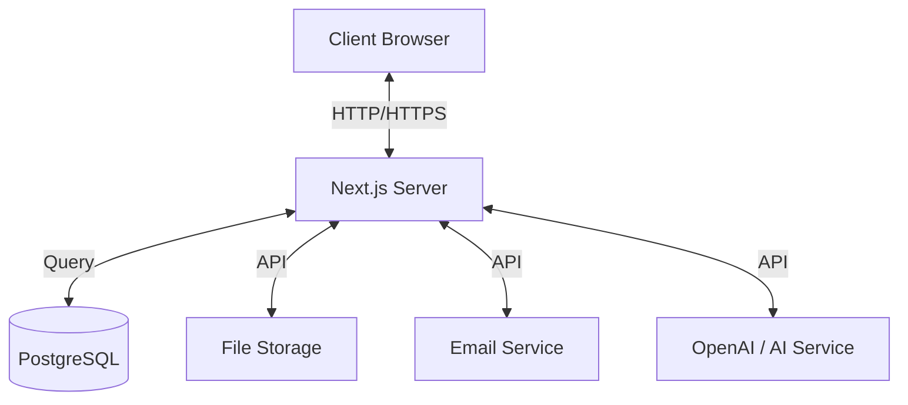

# Architecture Overview - Smart LMS SaaS

This document provides a high-level overview of the Smart LMS SaaS architecture, outlining the core components, data flow, and technology stack.

## 1. High-Level Architecture

The Smart LMS is built as a monolithic Next.js application leveraging modern Server Actions for backend logic and React Server Components (RSC) for efficient rendering.

### Core Components

1.  **Frontend/Client**: Next.js App Router (React), Shadcn UI, Tailwind CSS.
2.  **API Layer**: Next.js API Routes (`/api/*`) and Server Actions (`app/actions/*`).
3.  **Database**: PostgreSQL hosted on cloud (Neon/Supabase/etc.), managed via Prisma ORM.
4.  **Authentication**: NextAuth.js (v5) handling sessions, JWTs, and OAuth providers.
5.  **Storage**: UploadThing for file uploads (course assets, assignments).
6.  **Real-time**: Polling/WebSockets (placeholder) for live class notifications and chat.
7.  **Email**: Resend API for transactional emails (invites, notifications).

## 2. Directory Structure

- `app/`: Application routes and pages.
    - `(dashboard)/`: Protected routes for Students, Instructors, and Admins.
    - `(auth)/`: Authentication public pages.
    - `api/`: REST endpoints (webhooks, public API).
- `components/`:
    - `ui/`: Reusable atomic components (Buttons, Inputs).
    - `features/`: Business logic components (CourseCard, FileUpload).
    - `providers/`: Context providers (Theme, Session, Toast).
- `lib/`:
    - `db/`: Prisma client and database queries.
    - `auth/`: NextAuth configuration.
    - `utils/`: Helper functions.
    - `validations/`: Zod schemas for form validation.

## 3. Data Flow

1.  **User Request**: Client initiates request (e.g., "Enroll in Course").
2.  **Server Action**: Request hits `app/actions/enrollment.ts`.
3.  **Validation**: Zod schema validates input data.
4.  **Authorization**: `auth()` helper checks session and role permissions.
5.  **Database Operation**: Prisma executes query against PostgreSQL.
6.  **Response**: Server Action returns result; UI updates via `useOptimistic` or `toast`.

## 4. Key Systems

### Authentication & Authorization
- **RBAC**: Role-Based Access Control (Student, Instructor, Admin, Super Admin).
- **Middleware**: `middleware.ts` protects routes based on roles.
- **Session**: Secure HTTP-only cookies storing JWT.

### Course Management
- **Hierarchical content**: Courses -> Modules -> Lessons.
- **Rich Media**: Support for video (Mux/YouTube), attachments, and rich text.
- **Progress Tracking**: Granular lesson completion tracking.

### Assignments & Exams
- **Assignments**: File uploads, deadlines, grading interface.
- **Exams**: Timed quizzes, auto-grading (for objective questions), manual review.

### Architecture Diagram (Mermaid)

## 5. Deployment

- **Platform**: Vercel (recommended) or Docker container.
- **Database**: Managed PostgreSQL.
- **CI/CD**: GitHub Actions for linting, type-checking, and testing.

## 6. Security

- **Data Validation**: Strict Zod schemas.
- **API Security**: Rate limiting references `lib/rate-limit.ts`.
- **Environment**: Sensitive keys in `.env`.
